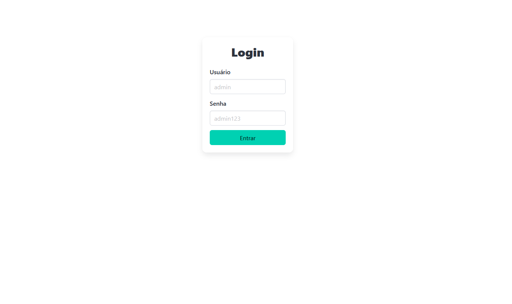
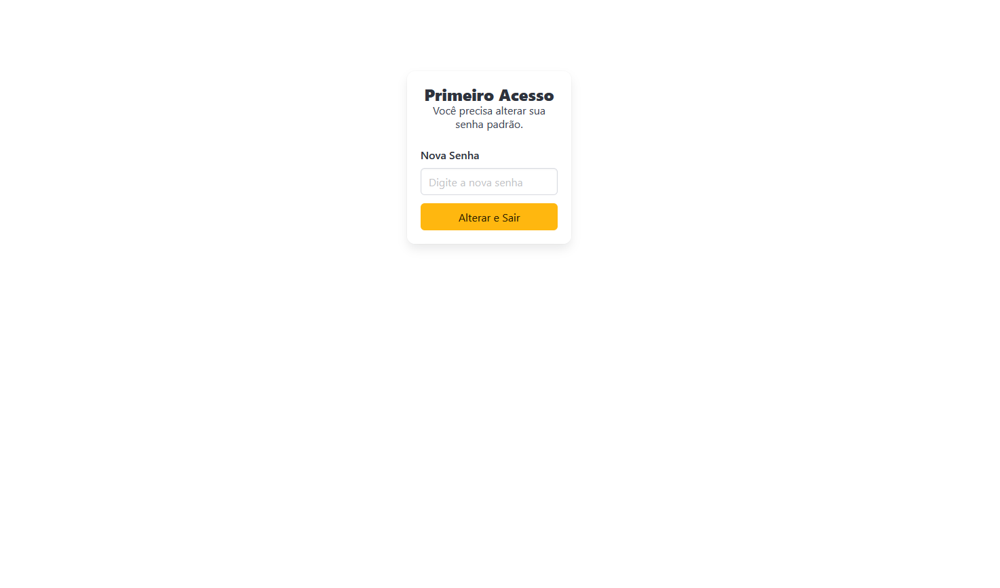
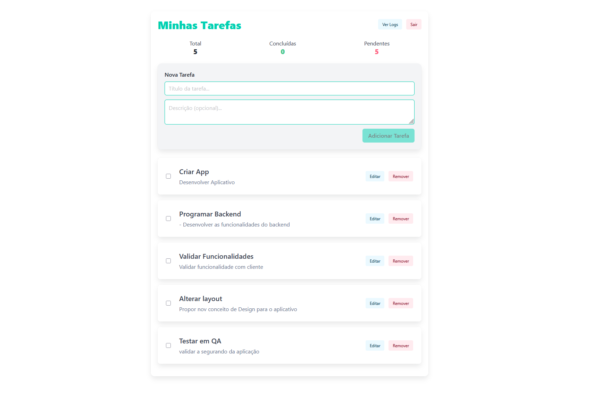

# Desafio Essentia Technologies - Sistema de Gestão de Tarefas

Este projeto é um sistema gestão de tarefas (To-Do List) desenvolvido como parte de um desafio técnico. A aplicação conta com autenticação segura e auditoria de logs em múltiplos bancos de dados.

## 📸 Demonstração

### **Tela de Login**


### **Interface Principal**


### **Visualização de Tarefas**


---

## 🚀 Tecnologias Utilizadas

### **Frontend**
- **Angular**: Utilizando as novas funcionalidades.
- **Bulma CSS**: Framework CSS moderno baseado em Flexbox para um layout limpo e responsivo.


### **Backend**
- **Node.js & Express**: API RESTful.
- **TypeScript**: Garantindo tipagem estática e maior manutenibilidade.
- **JWT (JSON Web Token)**: Autenticação segura via cookies **HttpOnly**.
- **Bcrypt.js**: Criptografia de senhas.

### **Bancos de Dados**
- **MySQL 8.0**: Armazenamento principal de tarefas e usuários.
- **MongoDB**: Banco NoSQL dedicado exclusivamente para logs de auditoria e atividades do sistema.

### **Infraestrutura**
- **Docker & Docker Compose**: Orquestração completa de containers para facilitar o deploy e desenvolvimento.

---

## Funcionalidades

- [x] **Autenticação**: Login com usuário padrão e expiração de sessão.
- [x] **Segurança**: Obrigatoriedade de troca de senha no primeiro acesso.
- [x] **CRUD de Tarefas**: Criar, visualizar, editar e excluir tarefas.
- [x] **Status**: Marcar tarefas como concluídas ou pendentes.
- [x] **Estatísticas**: Painel em tempo real com total de tarefas, concluídas e pendentes.
- [x] **Auditoria**: Logs detalhados de todas as ações salvos no MongoDB.
- [x] **Responsividade**: Interface otimizada para Desktop e Mobile.

---

##  Como Rodar o Projeto

### **Pré-requisitos**
- Docker e Docker Compose instalados.

### **Passo a Passo**

1.  **Clone o repositório**:
    ```bash
    git clone <url-do-repositorio>
    cd desafio-essentia-tecnologies
    ```

2.  **Suba os containers**:
    Na raiz do projeto, execute:
    ```bash
    docker-compose up --build -d
    ```

3.  **Acesse a aplicação**:
    - **Frontend**: [http://localhost:4200](http://localhost:4200)
    - **API**: [http://localhost:8085](http://localhost:8085)

---

##  Acesso Padrão

Ao iniciar o sistema pela primeira vez, utilize as seguintes credenciais:

- **Usuário**: `admin`
- **Senha**: `admin123`

> **Nota**: O sistema solicitará obrigatoriamente a alteração desta senha no primeiro login para garantir a segurança.

---

##  Estrutura do Projeto

- `/api`: Código fonte do backend Node.js.
- `/cliente`: Código fonte do frontend Angular.
- `docker-compose.yml`: Arquivo de orquestração dos serviços (MySQL, Mongo, API e Web).
- `.env.exemplo`: Modelo de variáveis de ambiente necessárias.

---

##  Logs de Auditoria
Os logs de atividade podem ser visualizados diretamente na interface clicando no botão **"Ver Logs"**. Eles registram:
- Tipo de ação (CRIAR, EDITAR, REMOVER, etc.)
- ID da tarefa afetada.
- Título da tarefa e timestamp.
- Detalhes das alterações realizadas.

---

